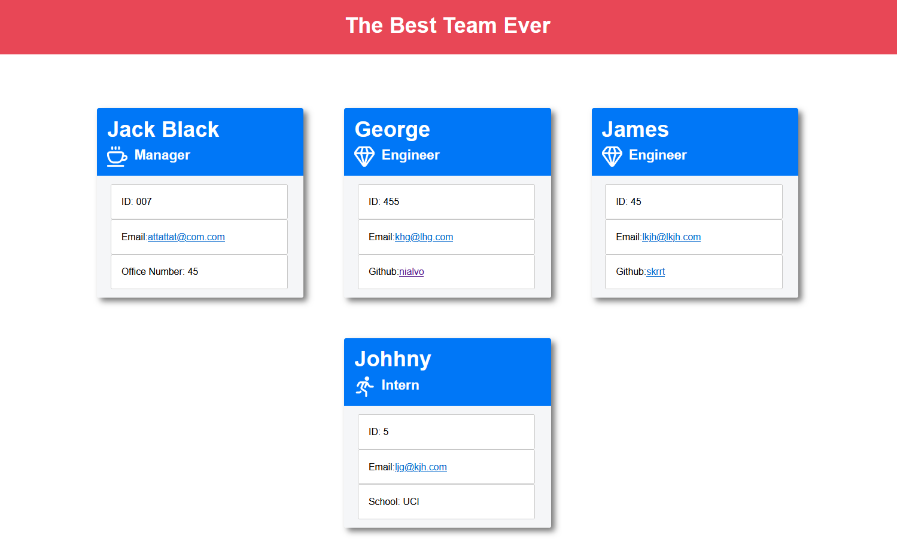

# rosterGenerator

This command line app gives the user prompts to enter information about the members of a team, and creates an html file which displys the team roster as shown in the picture below. 
 
The process for launching the program and creating the roster is demonstrated in this video: 
<iframe src="https://drive.google.com/file/d/1ZVqjeqqENvMHxwQe61720er_Mgpczjlu/preview" width="960" height="720"></iframe> 
For any questions, please contact me via email:
<a href="mailto:nialvo@protonmail.com">email</a>